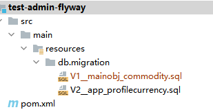

# Flyway项目说明
Flyway是市面流行常用的数据迁移工具，含数据库DDL版本管理功能。<br>
生成的Flyway项目是以数据字典为模板，按照Flyway命名规则输出DDL SCHEMA，并引用对应的MAVEN PLUGIN。
## Flyway介绍
- [官方文档](https://flywaydb.org/documentation/getstarted/firststeps/maven)
## 支持语法
- MYSQL
## 生成用例中的GlobalSettings说明
| 列名 | 说明 |
| ------- | ------- |
|    projectType     |      【必填】生成的项目类型,填FLYWAY      |
|    prjPrefix     |      【必填】项目前缀      |
|    prjName     |      【必填】项目名称      |
|    groupId     |      【必填】maven group id      |
|    gitRepo     |      【非必填】git地址,预留字段      |
|    dataDictionaryPath     |      【必填】数据字典文件路径      |
## 结构说明

### migration目录
数据字典模板中的每个sheet会分别以V(sheet顺序)__sheetname.sql的格式进行命名，并放置于资源目录的db/migration中。
### pom
pom文件会自动加入如下内容，在终端执行flyway:migrate命令即可根据配置连接数据库运行migration脚本。
```
<plugin>
                <groupId>org.flywaydb</groupId>
                <artifactId>flyway-maven-plugin</artifactId>
                <version>5.2.4</version>
                <dependencies>
                    <dependency>
                        <groupId>mysql</groupId>
                        <artifactId>mysql-connector-java</artifactId>
                        <version>6.0.3</version>
                    </dependency>
                </dependencies>
                <configuration>
                    <driver>com.mysql.jdbc.Driver</driver>
                    <url>jdbc:mysql://ip:port/dbname?useSSL=false</url>
                    <user>${flywayuser}</user>
                    <password>${flywaypwd}</password>
                    <baselineOnMigrate>true</baselineOnMigrate>
                    <validateOnMigrate>false</validateOnMigrate>
                </configuration>
            </plugin>
```
