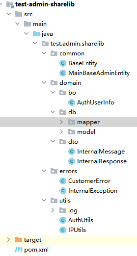

#通用工具包(JAR)说明
ShareLib是项目通用工具包，同一套系统的所有基础工具都会被中心化到此工具包中。
## 工具包介绍
- ORM框架为Mybatis Plus
- Entity转化 
默认使用lombok的@Data、@ToString方法
- MybatisMapper
> - 以Mysql语法生成增删查改接口方法
> - 包含insertIgnore/insertUpdate，createTime/updateTime自动填写
> - 所有唯一键会生成对应的查询
> - 所有is_开头的布尔值生成对应的状态变更方法
- 包含通用网络接口交互对象
- 包含通用异常定义
- 包含常用业务工具
> - 日志工具
> - 授权取值工具
> - IP获取工具  

## 生成用例中的GlobalSettings说明
| 列名 | 说明 |
| ------- | ------- |
|    projectType     |      【必填】生成的项目类型,填ShareModel      |
|    prjPrefix     |      【必填】项目前缀      |
|    prjName     |      【必填】项目名称      |
|    groupId     |      【必填】maven group id      |
|    gitRepo     |      【非必填】git地址,预留字段      |
|    dataDictionaryPath     |      【必填】数据字典文件路径      |
## 结构说明

> - common是entity基类定义
> - domain是业务常用entity定义，含po/bo/dto
> - errors是异常类目录
> - utils是工具类目录