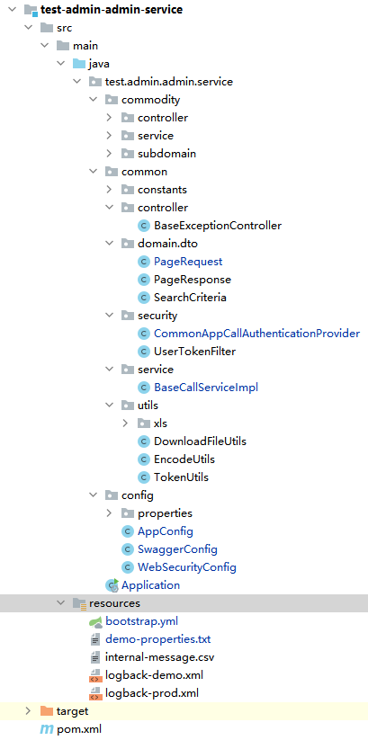

# 管理后台后应用说明
SpringBoodManagementApp是一套管理系统(后端),基于数据字典的定义进行可视化对象管理,可搭配前端ManagementVue配套使用。
## SpringBoodManagementApp框架介绍
- 启动框架为springcloud(默认使用K8S LB)
- ORM框架为Mybatis Plus
- Security框架为spring-security
- 接口文档工具为Swagger
- 包含常用xls工具
- 包含通用管理业务错误字典
- 包含常用业务工具与异常处理
- Nacos配置中心集成
- 日志框架Logback
## SpringBoodManagementApp业务功能
- 安全校验
- Entity的基础管理业务
> - Entity的任意字段过滤筛选功能
> - Entity的增加
> - Entity的修改
> - Entity的删除
>> - 逻辑删除(entity包含is_deleted字段定义)
>> - 物理删除
> - Entity的导入导出
> - Entity的状态修改
> - Entity对象字段校验
> - 导入导出数据查找分页功能
> - 日志格式规范
> - 接口对象规范

## 生成用例中的GlobalSettings说明
| 列名 | 说明 |
| ------- | ------- |
|    projectType     |      【必填】生成的项目类型,填CommonManagementApp      |
|    prjPrefix     |      【必填】项目前缀      |
|    prjName     |      【必填】项目名称      |
|    groupId     |      【必填】maven group id      |
|    gitRepo     |      【非必填】git地址,预留字段      |
|    dataDictionaryPath     |      【必填】数据字典文件路径      |
|    ManagementAppSettings.prjCNName     |      【必填】系统显示名称      |
|    dbData     |      【非必填】数据库连接信息      |
## 结构说明

> - common是项目内通用类定义
>> - constants是常量定义
>> - controller是接口基类
>> - dto为dto基类
>> - security是安全校验相关
>> - utils是项目内常用工具类 
> - config
> - 其他目录为以模板Main
